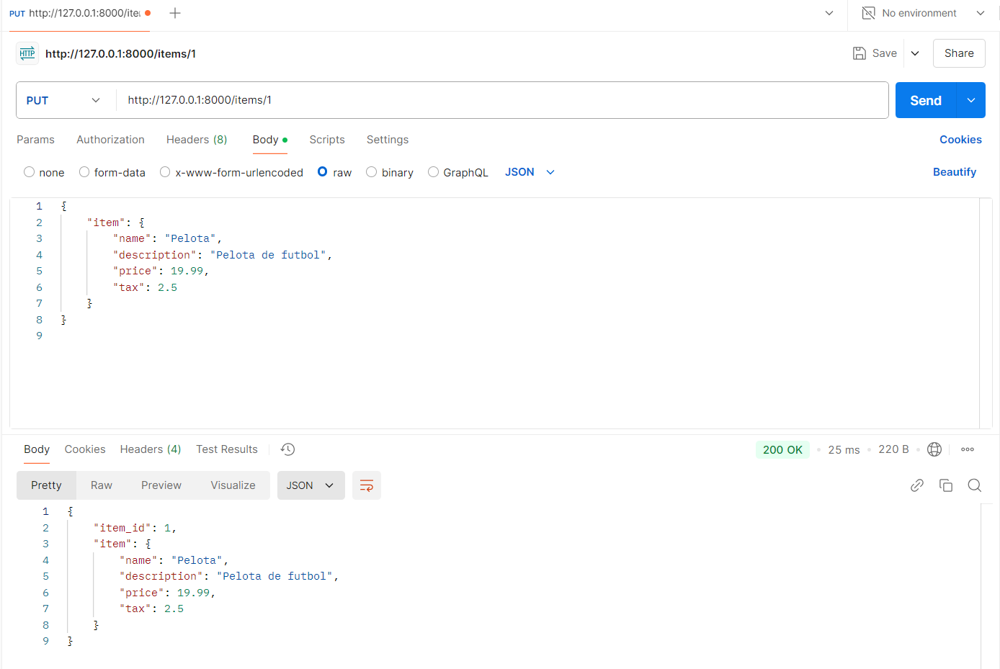

## Body-Fields en Postman

Este código crea un endpoint en FastAPI que utiliza el método PUT para 
actualizar un item existente en función de su ID. Se define un modelo de datos
llamado Item, que valida los campos enviados en el cuerpo de la solicitud, 
como el nombre, descripción, precio y tasa de impuestos. El endpoint procesa 
los datos recibidos, valida automáticamente los valores y devuelve una 
respuesta con el identificador del item actualizado y los nuevos datos.

## Body-Nested Models en Swagger

Este endpoint en FastAPI utiliza Body-Nested Models para gestionar datos 
complejos al actualizar un item por su ID. Swagger UI permite enviar un JSON 
con estructuras anidadas, validando automáticamente los campos y mostrando 
tanto los parámetros requeridos como la respuesta esperada. Esto facilita 
manejar modelos más detallados dentro de la API.

